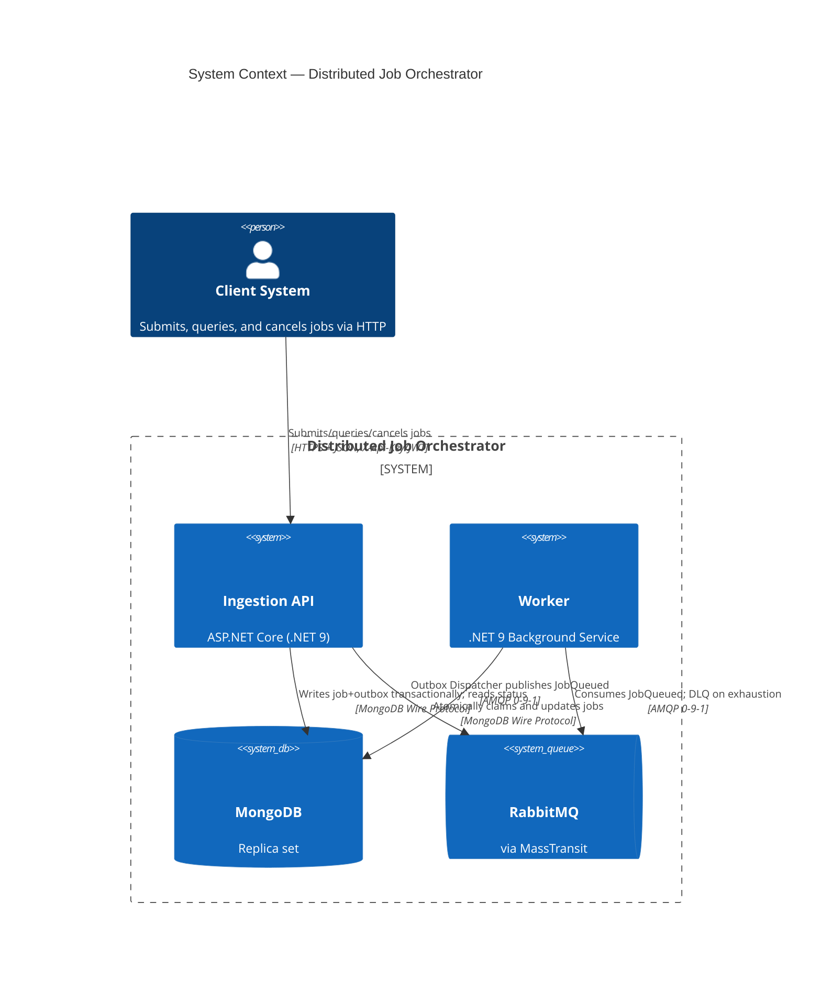
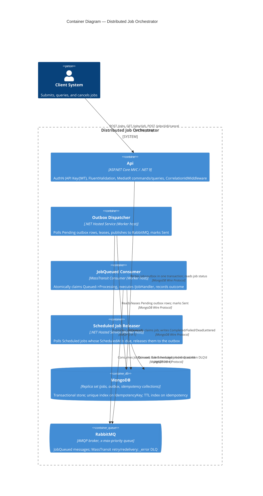

# Architecture — Distributed Job Orchestrator

> Companion to [`README.md`](./README.md) and [`README-SPECS.md`](./README-SPECS.md). This
> document explains **what was built and why**: the system overview, the Clean Architecture
> layer map, the reliability story, C4 diagrams, and the Architecture Decision Records (ADRs)
> behind the key technology choices. It documents the system realized by
> [`specs/`](./specs/) — see [`specs/007-deliverables/spec.md`](./specs/007-deliverables/spec.md)
> for the deliverable's own acceptance criteria.

## 1. System Overview

The challenge ([`GOAL.md`](../GOAL.md), one level above this repository) asks for a
high-availability **Distributed Job Orchestrator**: an API that ingests thousands of jobs per
minute and a pool of workers that process them, with a hard guarantee that **no job is ever
lost**, even if the application crashes, the broker goes down, or the database restarts.

Two properties drive every design decision in this repository (constitution §1):

1. **Durability first** — a job the API acknowledged (HTTP `202`) must survive any single
   infrastructure failure.
2. **No duplicate side effects** — at-least-once delivery means duplicates *will* happen, so
   every consumer and mutation is written to be idempotent.

The system is split into two independently deployable .NET 9 hosts sharing three inner layers:

- **`JobOrchestrator.Api`** — the ingestion gateway. Authenticates, validates, and durably
  accepts job submissions; exposes status lookup and cancellation.
- **`JobOrchestrator.Worker`** — the processing host. Dispatches outbox messages to RabbitMQ,
  consumes them, atomically claims jobs, executes handlers, and records outcomes.
- **MongoDB** (replica set) — the system of record for jobs, the outbox, and idempotency keys.
- **RabbitMQ** (via MassTransit) — the broker connecting the two hosts asynchronously.

## 2. Clean Architecture Layer Map

The solution enforces the constitution's inward-only dependency rule (§2.1) structurally, via
project references, and is checked by an architecture test
(`tests/JobOrchestrator.UnitTests/Architecture`) built with NetArchTest:

```
JobOrchestrator.Domain            ← no project or NuGet reference except the BCL
        ▲
JobOrchestrator.Application       ← references Domain only
        ▲
JobOrchestrator.Infrastructure    ← references Application + Domain
        ▲
JobOrchestrator.Api / .Worker     ← composition roots; reference everything
```

| Layer | Project | Key types found in the codebase |
|---|---|---|
| **Domain** | `JobOrchestrator.Domain` | `Jobs.Job` (aggregate root, private constructor, `Create`/`Rehydrate` factories), `Jobs.JobStatus`, `Jobs.Priority`, `Jobs.JobPriorityComparer`, `Jobs.JobFailureOutcome`, `Outbox.OutboxMessage`, `Outbox.OutboxMessageStatus`, `Exceptions.DomainException`, `Exceptions.InvalidJobStateTransitionException`. Pure C#/BCL only — no `MongoDB.Driver`, no `MassTransit`, no `Microsoft.AspNetCore` reference in the `.csproj`. |
| **Application** | `JobOrchestrator.Application` | CQRS handlers under `Features/Jobs`: `CreateJobCommand`/`Handler`/`Validator`, `CancelJobCommand`/`Handler`/`Validator`, `GetJobStatusQuery`/`Handler`. Ports under `Abstractions`: `IUnitOfWork`, `IJobRepository`, `IOutboxRepository`, `IJobClaimService`, `IIdempotencyStore`, `ICancellationRegistry`, `IClock`, `IJobHandler`, `IExternalDependencyGateway`. Cross-cutting `Behaviors.ValidationBehavior<,>` (MediatR pipeline). Composition via `ApplicationServiceCollectionExtensions.AddApplication()` — registers MediatR and every FluentValidation validator from the assembly by scanning, so new features self-register. |
| **Infrastructure** | `JobOrchestrator.Infrastructure` | Mongo implementations under `Persistence`: `MongoUnitOfWork`, `MongoJobRepository`, `MongoOutboxRepository`, `MongoJobClaimService`, `MongoIdempotencyStore`, `MongoSessionAccessor`, `MongoIndexInitializer` (hosted service), plus `Documents/` (BSON-mapped `JobDocument`, `OutboxMessageDocument`, `IdempotencyDocument`) and `Mappers/` (domain ↔ document translation, keeping Mongo shapes out of Domain). `Jobs.CancellationRegistry` backs `ICancellationRegistry`. `Messaging.RabbitMqOptions` and `Scheduling.ScheduledJobReleaser` (+ `ReleaserOptions`) round out the infra services. Composition via `InfrastructureServiceCollectionExtensions.AddInfrastructure()`. |
| **Hosts** | `JobOrchestrator.Api`, `JobOrchestrator.Worker` | Thin composition roots. `Api/Controllers/JobsController.cs` (+ `Api/Contracts/JobContracts.cs`, `Api/Contracts/ProblemResults.cs`) maps the MVC Controller surface described by [`specs/002-ingestion-api/contracts/openapi.yaml`](./specs/002-ingestion-api/contracts/openapi.yaml). `Api/Auth/ApiKeyAuthenticationHandler.cs` + `JwtOptions.cs` implement the dual API-Key/JWT scheme. `Api/Middleware/CorrelationIdMiddleware.cs` establishes `CorrelationId` at the edge. `Worker/Program.cs` hosts the background consumers/dispatcher. |
| **Tests** | `tests/JobOrchestrator.UnitTests`, `tests/JobOrchestrator.IntegrationTests` | Unit: `Domain/Jobs` (state machine) and `Architecture` (layer-dependency rules). Integration: `Persistence`, `Scheduling`, with `TestSupport` helpers (Testcontainers-based Mongo replica set, per constitution §7). |

## 3. The Reliability Story

The constitution's Reliability Doctrine (§4) is not aspirational — it maps directly onto types
already in the codebase:

### 3.1 Transactional Outbox

`CreateJobCommandHandler` (Application) writes a job and its outbox message **in one Mongo
transaction**, never "save then publish":

1. `IUnitOfWork.ExecuteInTransactionAsync(...)` — implemented by `MongoUnitOfWork`, which opens
   a Mongo client session, calls `session.WithTransactionAsync(...)`, and publishes the active
   session on `MongoSessionAccessor` so repository calls made inside the callback automatically
   join the same transaction.
2. Inside that callback, `IJobRepository` inserts the `jobs` document and `IOutboxRepository`
   inserts an `OutboxMessage` (`Domain.Outbox.OutboxMessage.Create(...)`, status `Pending`).
3. Both inserts commit atomically or neither does — the multi-document ACID guarantee MongoDB
   provides once it runs as a replica set (see ADR-001).

A separate **`OutboxDispatcher`** (a hosted service in `Infrastructure`/`Worker`, per
[`specs/004-worker-processing/plan.md`](./specs/004-worker-processing/plan.md)) polls
`outbox` documents where `Status = Pending` ordered by `CreatedAt`, leases each row
(`OutboxMessage.Lease(owner, now, leaseDuration)` — an atomic `Pending/expired-Dispatching →
Dispatching` claim so two dispatcher instances can't double-publish), publishes via MassTransit's
`IPublishEndpoint`, and finally calls `OutboxMessage.MarkSent(now)`. If the process crashes
between commit and publish, the row is still `Pending`/`Dispatching` on restart and gets
re-dispatched — no job is lost. If it crashes between publish and mark-sent, the row is
re-dispatched and published a second time; that duplicate is made harmless by consumer
idempotency (§3.3 below), not by dispatcher-side exactly-once tricks.

### 3.2 Atomic Distributed Claim

Multiple worker instances consume the same RabbitMQ queue. Exactly one may process a given job.
`MongoJobClaimService.TryClaimAsync` performs a **single conditional update**:

```csharp
var filter = Eq(d => d.JobId, jobId) & Eq(d => d.Status, JobStatus.Queued.ToString());
var update = Set(d => d.Status, JobStatus.Processing.ToString())
    .Set(d => d.UpdatedAt, now).Inc(d => d.Attempts, 1);
var result = await _collection.UpdateOneAsync(filter, update, ...);
return result.ModifiedCount == 1;
```

This is a `findAndModify`-style conditional write guarded by the *current* status — never a
"read the status, then write" race. If two workers race to claim the same job, MongoDB's
single-document atomicity guarantees only one `UpdateOneAsync` call matches and modifies the
document; the loser gets `ModifiedCount == 0`, returns `false`, and no-ops (acks the message
without doing the work again). See ADR-005 for why this beats a separate distributed-lock
collection.

### 3.3 Idempotency

Two independent idempotency mechanisms protect the two places duplicates can enter the system:

- **Ingestion idempotency** — `POST /jobs` accepts an `Idempotency-Key` header.
  `MongoIndexInitializer` creates a **unique index** `ux_jobs_idempotencyKey` on
  `JobDocument.IdempotencyKey`. A retried request with the same key hits the unique-index
  violation on insert; the handler catches it and returns the original job instead of creating a
  second one. A `MongoIdempotencyStore`-backed `idempotency` collection (TTL-indexed on
  `CreatedAt`, 24h default) additionally stores a request-hash so a *reused* key with a
  *different* payload is rejected with `409` rather than silently returning the wrong job.
- **Processing idempotency** — the atomic claim (§3.2) means a redelivered message for a job
  already `Processing`/`Completed`/`Cancelled`/`DeadLettered` simply fails to match the
  `Queued` filter, so `TryClaimAsync` returns `false` and the consumer acks without re-running
  the handler (FR-004-5).

### 3.4 Dead Letter Queue

Retries are bounded by the job's `MaxAttempts`. `Job.RecordFailure(error, now)` inspects
`Attempts` vs `MaxAttempts`: if budget remains, the job returns to `Queued` (picked up again by
the outbox/queue pipeline); once exhausted, it transitions to `JobStatus.DeadLettered` and
`JobFailureOutcome.DeadLettered` is returned to the caller. A separate
`Job.RecordPermanentFailure(...)` lets the worker dead-letter immediately on an unrecoverable
error (e.g. an unknown `Job.Type` or a poison/undeserializable message) without burning the
retry budget (FR-005-3). At the transport level, MassTransit's retry/redelivery middleware
governs backoff between attempts; once its redelivery count is exhausted, MassTransit
auto-routes the message to the queue's `_error` (DLQ) queue. The persisted `DeadLettered` status
and the `_error` queue are deliberately kept in sync so an operator can inspect either the
database or the broker and see the same picture (ADR-007).

## 4. C4 Diagrams

### 4.1 System Context



### 4.2 Container Diagram



A standalone copy of both diagrams lives in [`docs/diagrams/c4.md`](./docs/diagrams/c4.md).

## 5. Architecture Decision Records

MADR-style: Context → Decision → Consequences → Status.

---

### ADR-001 — MongoDB as the NoSQL store

**Status:** Accepted

**Context.** GOAL.md mandates a NoSQL database. The reliability doctrine requires a
transactional Outbox: the job and the "intent to publish" must commit atomically or not at all.
Most NoSQL stores trade away multi-document ACID transactions for scale; without them, the
Outbox pattern degenerates into "save then publish" — explicitly forbidden by the brief.

**Decision.** Use **MongoDB**, run as a **replica set** (even single-node), specifically because
MongoDB's multi-document transactions require a replica set — a standalone `mongod` rejects
`session.WithTransactionAsync(...)` with "Transaction numbers are only allowed on a replica set
member". This is why `docker-compose.yml` and the Testcontainers-based integration test fixtures
in this repo explicitly run `rs.initiate()` against a single-node replica set before the
application (or tests) connect — skipping that step silently voids the Outbox guarantee (the
transaction call throws at runtime, not at compile time). MongoDB's flexible document model
also fits `Job.Payload`/`Result` (opaque JSON) and TTL indexes serve the idempotency-key
expiry and (optionally) job retention.

**Consequences.**
- (+) One transactional write covers job + outbox row; no two-phase commit needed.
- (+) TTL indexes give free expiry for idempotency records.
- (+) Document shape maps naturally onto the `Job`/`OutboxMessage` aggregates.
- (−) Replica-set bootstrapping is one more moving part in Compose/Testcontainers/production
  (see ADR-008 for how the Terraform target handles this in a managed environment).
- (−) Multi-document transactions have a small performance cost versus single-document writes;
  acceptable here because the transactional write is two small documents, not a batch.

---

### ADR-002 — RabbitMQ + MassTransit as the messaging abstraction

**Status:** Accepted

**Context.** GOAL.md requires RabbitMQ and recommends an abstraction such as MassTransit rather
than talking to the RabbitMQ client library directly throughout the codebase.

**Decision.** Use **RabbitMQ** as the broker and **MassTransit** as the .NET abstraction over
it (`IPublishEndpoint` for publishing, `IConsumer<T>` for consumption). MassTransit also
supplies retry/redelivery middleware and `_error`/`_skipped` queue conventions used by the DLQ
strategy (ADR-007) and the priority queue topology (ADR-006).

**Consequences.**
- (+) Consumers and publishers are testable against an in-memory transport in unit tests, and
  against a real broker via Testcontainers in integration tests.
- (+) Retry/redelivery, DLQ routing, and message headers (used to carry `CorrelationId`) are
  configured declaratively instead of hand-rolled.
- (−) Adds a dependency and its own configuration surface (`RabbitMqOptions` in
  `Infrastructure/Messaging`); the team must understand MassTransit's retry vs. redelivery
  distinction to configure backoff correctly (see ADR-007).

---

### ADR-003 — Hand-rolled transactional Outbox instead of MassTransit's built-in outbox

**Status:** Accepted

**Context.** MassTransit ships its own outbox integrations (e.g. the EF Core outbox, and a
in-memory/bus outbox for guaranteeing publish-after-consume). GOAL.md is explicit: *"Não
aceitável apenas 'salvar e depois publicar' sem transação/garantia"* — the Outbox pattern must be
demonstrated as a real, visible transactional guarantee, not hidden inside a framework feature
that a reviewer cannot inspect.

**Decision.** Implement the Outbox **by hand** against MongoDB: `Job` and `OutboxMessage` are
written in the same `IUnitOfWork.ExecuteInTransactionAsync` transaction (`MongoUnitOfWork` +
`MongoSessionAccessor`), and a dedicated `OutboxDispatcher` hosted service polls, leases,
publishes, and marks rows sent. MassTransit's own outbox support targets EF Core/relational
providers primarily and would obscure the exact mechanism this project is graded on.

**Consequences.**
- (+) The transactional guarantee is explicit, inspectable code (`MongoUnitOfWork`,
  `OutboxMessage.Lease`/`MarkSent`, `MongoOutboxRepository`) rather than a black box — directly
  answers the brief's requirement.
- (+) Full control over lease/claim semantics for multiple dispatcher instances.
- (−) More code to own and test than adopting a framework feature (mitigated: covered by
  integration tests in `tests/JobOrchestrator.IntegrationTests`, per
  [`specs/004-worker-processing/plan.md`](./specs/004-worker-processing/plan.md) §7).
- (−) Duplicate publishes are possible in the crash window between publish and mark-sent; this is
  accepted and made harmless by consumer idempotency (§3.3) rather than avoided.

---

### ADR-004 — CQRS via MediatR

**Status:** Accepted

**Context.** GOAL.md lists CQRS as optional but desirable. The constitution (§2.4) elevates it
to required, reasoning that separating the write path (durability-critical: create/cancel) from
the read path (status lookup) clarifies which operations must honor the reliability doctrine.

**Decision.** Use **MediatR** as the in-process mediator. Commands
(`CreateJobCommand`, `CancelJobCommand`) and Queries (`GetJobStatusQuery`) live under
`Application/Features/Jobs`, each with its own handler — commands and queries never share a
handler. `ApplicationServiceCollectionExtensions.AddApplication()` registers MediatR and scans
the assembly for handlers/validators, plus a `ValidationBehavior<,>` pipeline behavior that runs
FluentValidation before any handler executes.

**Consequences.**
- (+) Clear separation: a reviewer can see at a glance that `GetJobStatusQueryHandler` never
  mutates state.
- (+) The validation pipeline behavior is cross-cutting — new commands get validation for free
  by registering a validator, no handler boilerplate.
- (−) An extra layer of indirection (mediator dispatch) versus calling application services
  directly; judged worth it for the clarity CQRS gives reviewers grading this exact concern.

---

### ADR-005 — Distributed claim via atomic Mongo conditional update

**Status:** Accepted

**Context.** GOAL.md requires that multiple worker instances never process the same job twice,
suggesting a distributed lock "if necessary". A separate lock collection (e.g. a `locks`
collection with a lease TTL, or a Redis-based `RedLock`) is a common pattern but adds an
independent failure mode: the lock store can drift from the resource it protects.

**Decision.** Use a **single atomic conditional update** on the job document itself:
`MongoJobClaimService.TryClaimAsync` issues one `UpdateOneAsync` filtered on `JobId == id AND
Status == Queued`, setting `Status = Processing` and incrementing `Attempts`. MongoDB guarantees
single-document write atomicity, so exactly one concurrent caller can ever match and modify the
document; every other caller observes `ModifiedCount == 0` and no-ops. No separate lock
collection, TTL lease, or external coordinator is introduced.

**Consequences.**
- (+) Simplest correct primitive — the "lock" and the "resource" are the same document, so they
  cannot drift out of sync with each other.
- (+) No extra infrastructure (no Redis/ZooKeeper) and no lease-expiry edge cases to reason about
  for job claiming specifically.
- (+) Naturally idempotent: a redelivered message for a job that already left `Queued` simply
  fails to match the filter.
- (−) A worker that claims a job and then crashes mid-processing leaves the job "stuck" in
  `Processing` until a future feature adds a claim-staleness sweep/lease timeout; today recovery
  is via message redelivery once MassTransit's consumer transaction times out, not a
  Mongo-side lease. Noted as a possible follow-up, not required by the current specs.
- (−) The outbox row *does* use a separate lease (`LeaseOwner`/`LeaseUntil` on `OutboxMessage`)
  because multiple dispatcher instances need to coordinate over rows still `Pending`, a
  different concurrency shape than the job claim; the two mechanisms are intentionally not
  unified.

---

### ADR-006 — RabbitMQ priority queue (`x-max-priority`) for job priority

**Status:** Accepted

**Context.** GOAL.md requires `High`-priority jobs to "furar a fila" (jump the queue) ahead of
`Low`-priority jobs. Two designs were considered: (a) one RabbitMQ queue declared with the
`x-max-priority` argument, publishing each `JobQueued` message with a `priority` property derived
from `Domain.Jobs.Priority`/`JobPriorityComparer`; or (b) two separate queues (high/low) with a
worker that always drains high before low.

**Decision.** Use a **single priority-enabled queue** (`x-max-priority`), with the message's
AMQP `priority` field set from the job's `Priority` at publish time (Outbox Dispatcher). RabbitMQ
then delivers higher-priority messages first among those currently ready in the queue.

**Consequences.**
- (+) One queue, one consumer topology — simpler MassTransit configuration than managing two
  queues and worker-side draining order.
- (+) `Domain.Jobs.JobPriorityComparer` (pure domain logic, unit-tested) stays the single source
  of truth for "what does High vs Low mean", independent of the transport detail.
- (−) RabbitMQ priority queues only reorder messages **already sitting in the queue** — they do
  not preempt a message a consumer has already prefetched. Per FR-003-2, this is intentional: a
  Low job in flight is delayed relative to a newly arriving High job, never dropped or starved
  outright (priority affects ordering, not admission).
- (−) Priority levels have a practical ceiling (RabbitMQ recommends ≤ 10) — acceptable since the
  domain only defines two levels (`High`, `Low`).

---

### ADR-007 — DLQ via MassTransit's `_error` queue plus a persisted `DeadLettered` job status

**Status:** Accepted

**Context.** Poison messages (permanently failing handlers, bad payloads) must never be retried
forever nor silently dropped (constitution §4). The system needs both an operational parking lot
(so an operator can inspect/replay the raw message) and a business-level signal (so `GET
/jobs/{id}` reports the job's true state to API clients, who cannot see RabbitMQ directly).

**Decision.** Combine two complementary mechanisms rather than choosing one:
1. **Transport level** — rely on MassTransit's standard retry/redelivery pipeline; once the
   configured redelivery count is exhausted (or a poison/deserialization error is detected
   immediately), MassTransit auto-routes the message to the queue's conventional `_error` queue.
2. **Domain/persistence level** — `Job.RecordFailure` transitions the job to
   `JobStatus.DeadLettered` once `Attempts >= MaxAttempts`; `Job.RecordPermanentFailure` does the
   same immediately for unrecoverable errors, bypassing the retry budget (FR-005-3).

**Consequences.**
- (+) An operator can inspect `_error` in the RabbitMQ management UI for the raw poisoned
  message, while an API client gets the same fact (`status: DeadLettered`, `error: "..."`)
  through the ordinary status endpoint — no bespoke DLQ-query API needed.
- (+) Poison messages that can never succeed (e.g. unknown `Job.Type`) skip the retry budget
  entirely instead of wasting `MaxAttempts` attempts before landing in the same place.
- (−) Two sources of truth (broker `_error` queue and Mongo `DeadLettered` status) must stay
  conceptually aligned; they are written from the same code path (the consumer's failure
  handling) so they cannot diverge in normal operation, but a manual broker-side requeue from
  `_error` without updating Mongo would desync them — out of scope for this reference
  implementation (noted as a future admin-tool concern per
  [`specs/005-resilience/spec.md`](./specs/005-resilience/spec.md) §5).

---

### ADR-008 — Terraform target: single Docker Compose host on AWS EC2 (generic reference)

**Status:** Accepted

**Context.** GOAL.md marks Terraform IaC as a differentiator, not a requirement to run a live
deployment (`specs/007-deliverables/spec.md` explicitly puts "applying Terraform to a real cloud
account" out of scope). Two shapes were weighed:
- **(a) A "real" cloud-native reference**: ECS Fargate services for Api/Worker, Amazon DocumentDB
  or a self-managed MongoDB replica set on EC2, and Amazon MQ for RabbitMQ.
- **(b) A generic single-VM reference**: one cloud VM running the same `docker-compose.yml` used
  locally, bootstrapped via cloud-init.

Option (a) is more "production-shaped" but introduces a compatibility caveat that undercuts the
very pattern this project is graded on: **Amazon DocumentDB's MongoDB-API compatibility layer
does not support multi-document ACID transactions the way genuine MongoDB does** (its
transaction support and consistency model differ from replica-set MongoDB), which would silently
threaten the transactional Outbox (ADR-001/ADR-003) — the single most important reliability
guarantee in this system. Reproducing genuine MongoDB semantics on AWS would mean self-managing a
replica set on EC2 anyway, which is most of option (b)'s effort with more moving parts (ECS task
defs, Amazon MQ, VPC wiring) layered on top, for a deliverable explicitly scoped as a reference,
not a hardened production deployment.

**Decision.** Target a **single EC2 VM running Docker Compose**, provisioned by Terraform and
bootstrapped via `cloud-init` (`user_data`) to install Docker, pull this repository's compose
file, and run `docker compose up -d`. This is the most honest infrastructure-as-code
representation of "the same reliability guarantees demonstrated locally, now running on a cloud
VM" — it reuses the exact replica-set MongoDB and RabbitMQ topology already validated in
`001-solution-foundation`, with no compatibility-layer risk. See
[`infra/terraform/README.md`](./infra/terraform/README.md) for prerequisites and the
init/validate/plan/apply flow, and [`infra/terraform/main.tf`](./infra/terraform/main.tf) for the
resource definitions.

**Consequences.**
- (+) No DocumentDB transaction-compatibility risk — MongoDB runs exactly as validated locally.
- (+) Small, reviewable Terraform surface (VPC/security group/EC2 instance/EIP) that maps
  directly onto the architecture diagrams in §4, easy for a reviewer to read end-to-end.
- (+) Matches the deliverable's own scope note: a reference/demo, not a hardened production
  topology.
- (−) A single VM is not horizontally scalable and is a single point of failure — explicitly
  **not** how this system would be deployed for real production traffic. A follow-up ADR would
  be needed before going to production (e.g. moving to option (a) with a self-managed MongoDB
  replica set across multiple EC2 instances or a properly transaction-compatible managed Mongo
  offering, plus ECS/Fargate for the hosts and Amazon MQ for RabbitMQ).
- (−) Manual patching/upgrades of the VM's OS and Docker Engine are the operator's
  responsibility; no managed-service SLAs apply.
- Future work, if this were promoted beyond a reference deployment: split Api/Worker onto
  separate autoscaled ECS services, move MongoDB to a properly transaction-compatible
  multi-node replica set (self-managed or a compatible managed offering), and put RabbitMQ
  behind Amazon MQ's HA broker configuration.

## 6. Traceability

Every ADR above closes an "Open Question default" left in its owning feature spec:

| ADR | Closes open question in |
|---|---|
| ADR-001 | [`specs/001-solution-foundation/spec.md`](./specs/001-solution-foundation/spec.md) (implicit — constitution §3 constraint) |
| ADR-002 | constitution §3 baseline |
| ADR-003 | [`specs/004-worker-processing/spec.md`](./specs/004-worker-processing/spec.md) §6 |
| ADR-004 | constitution §2.4 |
| ADR-005 | [`specs/004-worker-processing/spec.md`](./specs/004-worker-processing/spec.md) §6 |
| ADR-006 | [`specs/003-task-management/spec.md`](./specs/003-task-management/spec.md) §6 |
| ADR-007 | [`specs/005-resilience/spec.md`](./specs/005-resilience/spec.md) §6 |
| ADR-008 | [`specs/007-deliverables/spec.md`](./specs/007-deliverables/spec.md) §6 |

For the full requirement-to-acceptance-criterion mapping, see the traceability matrix in
[`README-SPECS.md`](./README-SPECS.md).
