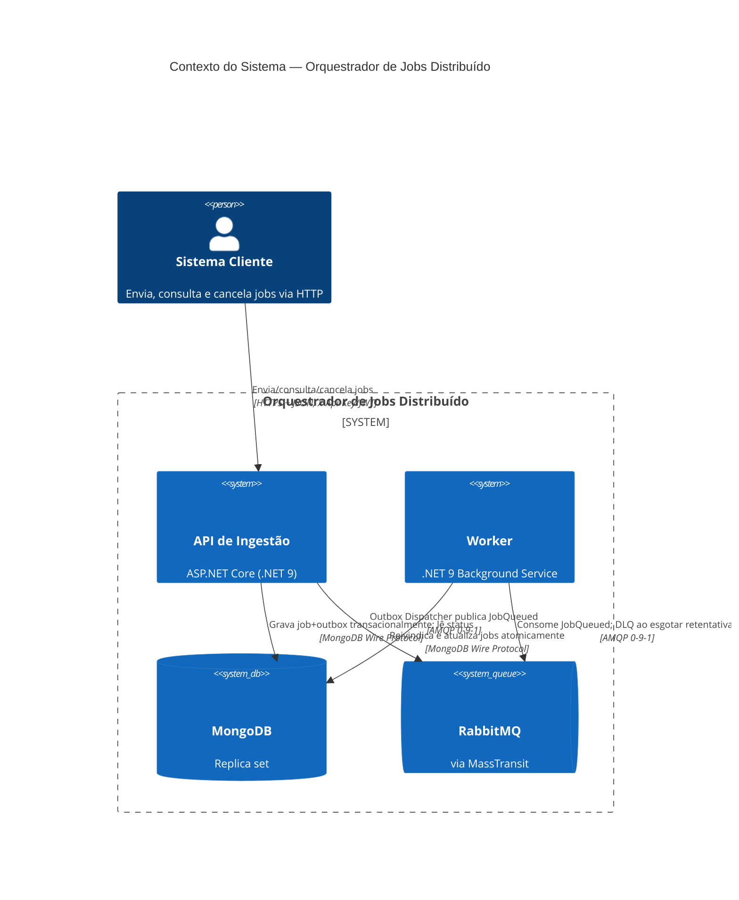
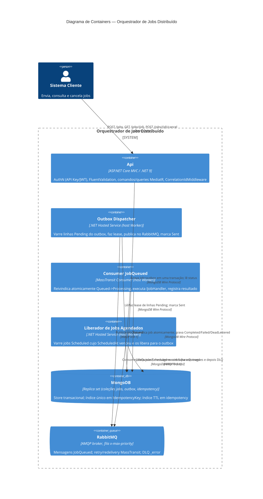

# Arquitetura — Orquestrador de Jobs Distribuído

> Complemento ao [`README.md`](./README.md). Este documento explica **o que foi construído e
> por quê**: a visão geral do sistema, o mapa de camadas da Clean Architecture, as garantias de
> confiabilidade, os diagramas C4 e os Registros de Decisão de Arquitetura (ADRs) por trás das
> principais escolhas tecnológicas.

## 1. Visão Geral do Sistema

Este é um **Orquestrador de Jobs Distribuído** de alta disponibilidade: uma API que ingere
milhares de jobs por minuto e um pool de workers que os processa, com a garantia rígida de que
**nenhum job seja perdido**, mesmo que a aplicação falhe, o broker caia ou o banco de dados
reinicie.

Duas propriedades guiam cada decisão de design neste sistema:

1. **Durabilidade acima de tudo** — um job que a API reconheceu (HTTP `202`) deve sobreviver a
   qualquer falha simples de infraestrutura.
2. **Sem efeitos colaterais duplicados** — entrega pelo menos uma vez significa que duplicatas
   *vão* acontecer, portanto todo consumer e toda mutação é escrita para ser idempotente.

O sistema é dividido em dois hosts .NET 9 implantáveis independentemente, compartilhando três
camadas internas:

- **`JobOrchestrator.Api`** — o gateway de ingestão. Autentica, valida e aceita submissões de
  jobs de forma durável; expõe consulta de status e cancelamento.
- **`JobOrchestrator.Worker`** — o host de processamento. Despacha mensagens do outbox para o
  RabbitMQ, consome-as, reivindica jobs atomicamente, executa handlers e registra resultados.
- **MongoDB** (replica set) — o sistema de registro para jobs, o outbox e chaves de idempotência.
- **RabbitMQ** (via MassTransit) — o broker que conecta os dois hosts de forma assíncrona.

## 2. Mapa de Camadas (Clean Architecture)

A solução aplica a regra de dependência unidirecional (de fora para dentro) de forma estrutural,
via referências de projeto, e é verificada por um teste de arquitetura
(`tests/JobOrchestrator.UnitTests/Architecture`) construído com NetArchTest:

```
JobOrchestrator.Domain            ← nenhuma referência a projeto ou NuGet, exceto a BCL
        ▲
JobOrchestrator.Application       ← referencia apenas Domain
        ▲
JobOrchestrator.Infrastructure    ← referencia Application + Domain
        ▲
JobOrchestrator.Api / .Worker     ← composition roots; referenciam tudo
```

| Camada | Projeto | Tipos principais no código |
|---|---|---|
| **Domain** | `JobOrchestrator.Domain` | `Jobs.Job` (aggregate root, construtor privado, fábricas `Create`/`Rehydrate`), `Jobs.JobStatus`, `Jobs.Priority`, `Jobs.JobPriorityComparer`, `Jobs.JobFailureOutcome`, `Outbox.OutboxMessage`, `Outbox.OutboxMessageStatus`, `Exceptions.DomainException`, `Exceptions.InvalidJobStateTransitionException`. C#/BCL puro — sem `MongoDB.Driver`, `MassTransit` ou `Microsoft.AspNetCore` no `.csproj`. |
| **Application** | `JobOrchestrator.Application` | Handlers CQRS em `Features/Jobs`: `CreateJobCommand`/`Handler`/`Validator`, `CancelJobCommand`/`Handler`/`Validator`, `GetJobStatusQuery`/`Handler`. Ports em `Abstractions`: `IUnitOfWork`, `IJobRepository`, `IOutboxRepository`, `IJobClaimService`, `IIdempotencyStore`, `ICancellationRegistry`, `IClock`, `IJobHandler`, `IExternalDependencyGateway`. `Behaviors.ValidationBehavior<,>` transversal (pipeline MediatR). Composição via `ApplicationServiceCollectionExtensions.AddApplication()` — registra MediatR e todos os validadores FluentValidation do assembly por varredura, para que novas features se auto-registrem. |
| **Infrastructure** | `JobOrchestrator.Infrastructure` | Implementações Mongo em `Persistence`: `MongoUnitOfWork`, `MongoJobRepository`, `MongoOutboxRepository`, `MongoJobClaimService`, `MongoIdempotencyStore`, `MongoSessionAccessor`, `MongoIndexInitializer` (hosted service), mais `Documents/` (documentos BSON: `JobDocument`, `OutboxMessageDocument`, `IdempotencyDocument`) e `Mappers/` (tradução domínio ↔ documento, mantendo shapes Mongo fora do Domain). `Jobs.CancellationRegistry` implementa `ICancellationRegistry`. `Messaging.RabbitMqOptions` e `Scheduling.ScheduledJobReleaser` (+ `ReleaserOptions`) completam os serviços de infra. Composição via `InfrastructureServiceCollectionExtensions.AddInfrastructure()`. |
| **Hosts** | `JobOrchestrator.Api`, `JobOrchestrator.Worker` | Composition roots enxutos. `Api/Controllers/JobsController.cs` (+ `Api/Contracts/JobContracts.cs`, `Api/Contracts/ProblemResults.cs`) mapeia a superfície MVC Controller. `Api/Auth/ApiKeyAuthenticationHandler.cs` + `JwtOptions.cs` implementam o esquema dual API-Key/JWT. `Api/Middleware/CorrelationIdMiddleware.cs` estabelece o `CorrelationId` na borda. `Worker/Program.cs` hospeda os consumers/dispatcher em background. |
| **Testes** | `tests/JobOrchestrator.UnitTests`, `tests/JobOrchestrator.IntegrationTests` | Unitários: `Domain/Jobs` (máquina de estados) e `Architecture` (regras de dependência de camada). Integração: `Persistence`, `Scheduling`, com helpers `TestSupport` (replica set Mongo via Testcontainers). |

## 3. Garantias de Confiabilidade

A Doutrina de Confiabilidade não é aspiracional — ela mapeia diretamente para tipos já
existentes no código:

### 3.1 Outbox Transacional

`CreateJobCommandHandler` (Application) grava um job e sua mensagem de outbox **em uma única
transação Mongo**, nunca "salva e depois publica":

1. `IUnitOfWork.ExecuteInTransactionAsync(...)` — implementado por `MongoUnitOfWork`, que abre
   uma sessão Mongo, chama `session.WithTransactionAsync(...)` e publica a sessão ativa em
   `MongoSessionAccessor` para que chamadas a repositórios dentro do callback automaticamente
   participem da mesma transação.
2. Dentro desse callback, `IJobRepository` insere o documento `jobs` e `IOutboxRepository`
   insere um `OutboxMessage` (`Domain.Outbox.OutboxMessage.Create(...)`, status `Pending`).
3. Ambas as inserções são confirmadas atomicamente ou nenhuma é — a garantia ACID multi-documento
   que o MongoDB oferece quando roda como replica set (veja ADR-001).

Um **`OutboxDispatcher`** separado (um hosted service em `Infrastructure`/`Worker`) varre
documentos `outbox` onde `Status = Pending` ordenados por `CreatedAt`, faz o lease de cada linha
(`OutboxMessage.Lease(owner, now, leaseDuration)` — um claim atômico `Pending/Dispatching-expirado
→ Dispatching` para que duas instâncias de dispatcher não publiquem a mesma mensagem), publica
via `IPublishEndpoint` do MassTransit e finalmente chama `OutboxMessage.MarkSent(now)`. Se o
processo falhar entre o commit e a publicação, a linha ainda está `Pending`/`Dispatching` na
reinicialização e será reenviada — nenhum job é perdido. Se falhar entre a publicação e o
mark-sent, a linha é reenviada e publicada novamente; esse duplicado é tornado inofensivo pela
idempotência do consumer (§3.3 abaixo), não por truques de exactly-once no lado do dispatcher.

### 3.2 Claim Distribuído Atômico

Múltiplas instâncias de worker consomem a mesma fila do RabbitMQ. Exatamente uma pode processar
um dado job. `MongoJobClaimService.TryClaimAsync` executa uma **única atualização condicional**:

```csharp
var filter = Eq(d => d.JobId, jobId) & Eq(d => d.Status, JobStatus.Queued.ToString());
var update = Set(d => d.Status, JobStatus.Processing.ToString())
    .Set(d => d.UpdatedAt, now).Inc(d => d.Attempts, 1);
var result = await _collection.UpdateOneAsync(filter, update, ...);
return result.ModifiedCount == 1;
```

Isso é uma escrita condicional estilo `findAndModify` protegida pelo status *atual* — nunca uma
corrida de "ler o status, depois escrever". Se dois workers competem pelo mesmo job, a atomicidade
de documento único do MongoDB garante que apenas um `UpdateOneAsync` corresponde e modifica o
documento; o perdedor recebe `ModifiedCount == 0`, retorna `false` e não faz nada (confirma a
mensagem sem realizar o trabalho novamente). Veja ADR-005 para entender por que isso supera uma
coleção de locks distribuídos separada.

### 3.3 Idempotência

Dois mecanismos de idempotência independentes protegem os dois pontos onde duplicatas podem
entrar no sistema:

- **Idempotência de ingestão** — `POST /jobs` aceita um header `Idempotency-Key`.
  `MongoIndexInitializer` cria um **índice único** `ux_jobs_idempotencyKey` em
  `JobDocument.IdempotencyKey`. Uma retentativa com a mesma chave atinge a violação de índice
  único no insert; o handler a captura e retorna o job original em vez de criar um segundo.
  Uma coleção `idempotency` (com índice TTL em `CreatedAt`, padrão 24h) também armazena um hash
  da requisição para que uma chave *reutilizada* com um payload *diferente* seja rejeitada com
  `409` em vez de retornar silenciosamente o job errado.
- **Idempotência de processamento** — o claim atômico (§3.2) significa que uma mensagem
  re-entregue para um job já em `Processing`/`Completed`/`Cancelled`/`DeadLettered` simplesmente
  não corresponde ao filtro `Queued`, portanto `TryClaimAsync` retorna `false` e o consumer
  confirma sem re-executar o handler (FR-004-5).

### 3.4 Fila de Mensagens Mortas (DLQ)

As retentativas são limitadas pelo `MaxAttempts` do job. `Job.RecordFailure(error, now)` inspeciona
`Attempts` vs `MaxAttempts`: se ainda há orçamento, o job volta para `Queued` (coletado novamente
pelo pipeline outbox/fila); quando esgotado, transita para `JobStatus.DeadLettered` e
`JobFailureOutcome.DeadLettered` é retornado ao chamador. Um método separado
`Job.RecordPermanentFailure(...)` permite que o worker marque o job como morto imediatamente em
caso de erro irrecuperável (ex.: `Job.Type` desconhecido ou mensagem inválida/não desserializável)
sem consumir o orçamento de retentativas (FR-005-3). No nível de transporte, o middleware de
retry/redelivery do MassTransit governa o backoff entre tentativas; quando seu contador de
redelivery se esgota, o MassTransit roteia automaticamente a mensagem para a fila `_error` (DLQ)
da fila. O status `DeadLettered` persistido e a fila `_error` são mantidos intencionalmente
sincronizados para que um operador possa inspecionar o banco de dados ou o broker e ver o mesmo
estado (ADR-007).

## 4. Diagramas C4

### 4.1 Contexto do Sistema



### 4.2 Diagrama de Containers



Uma cópia autônoma de ambos os diagramas está em [`docs/diagrams/c4.md`](./docs/diagrams/c4.md).

## 5. Registros de Decisão de Arquitetura (ADRs)

As decisões arquiteturais estão documentadas individualmente em [`docs/adrs/`](./docs/adrs/):

| ADR | Título | Status |
|---|---|---|
| [ADR-001](./docs/adrs/ADR-001-mongodb-nosql.md) | MongoDB como banco de dados NoSQL | Aceito |
| [ADR-002](./docs/adrs/ADR-002-rabbitmq-masstransit.md) | RabbitMQ + MassTransit como abstração de mensageria | Aceito |
| [ADR-003](./docs/adrs/ADR-003-outbox-transacional.md) | Outbox transacional implementado manualmente | Aceito |
| [ADR-004](./docs/adrs/ADR-004-cqrs-mediatr.md) | CQRS via MediatR | Aceito |
| [ADR-005](./docs/adrs/ADR-005-claim-distribuido.md) | Claim distribuído via atualização condicional atômica | Aceito |
| [ADR-006](./docs/adrs/ADR-006-fila-prioridade.md) | Fila com prioridade do RabbitMQ (`x-max-priority`) | Aceito |
| [ADR-007](./docs/adrs/ADR-007-dead-letter-queue.md) | DLQ via fila `_error` + status `DeadLettered` | Aceito |
| [ADR-008](./docs/adrs/ADR-008-terraform-ec2.md) | Target Terraform: host Docker Compose único em EC2 | Aceito |

