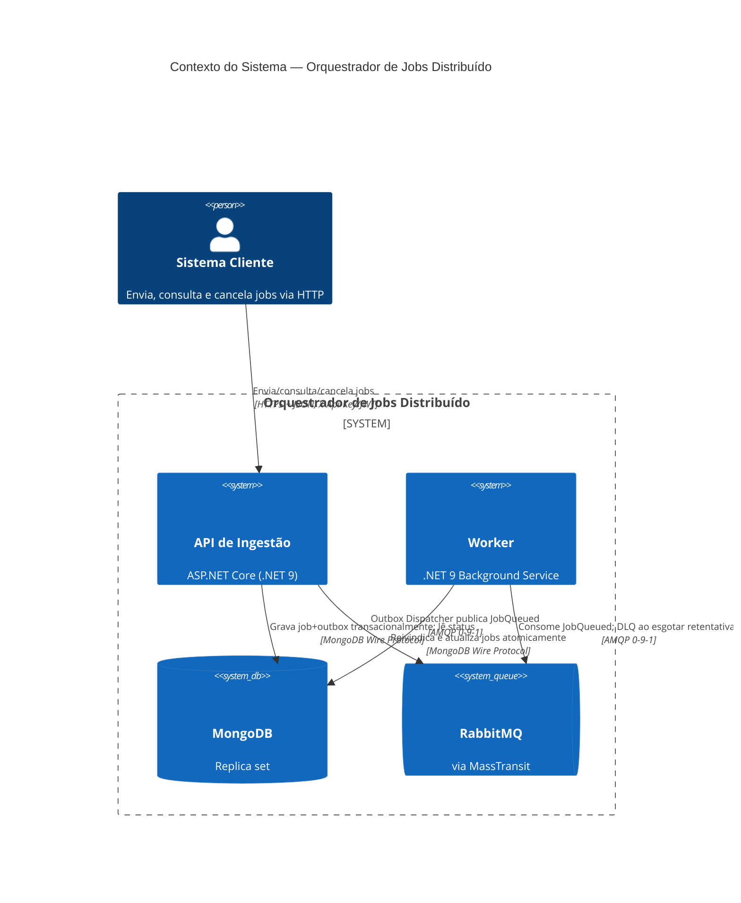
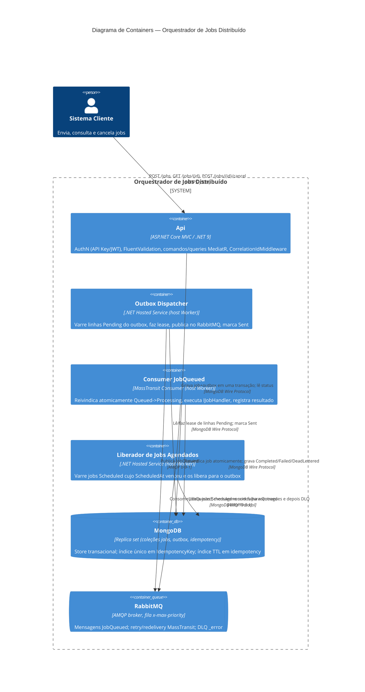

# Arquitetura — Orquestrador de Jobs Distribuído

> Complemento ao [`README.md`](./README.md). Este documento explica **o que foi construído e
> por quê**: a visão geral do sistema, o mapa de camadas da Clean Architecture, as garantias de
> confiabilidade, os diagramas C4 e os Registros de Decisão de Arquitetura (ADRs) por trás das
> principais escolhas tecnológicas.

## 1. Visão Geral do Sistema

Este é um **Orquestrador de Jobs Distribuído** de alta disponibilidade: uma API que ingere
milhares de jobs por minuto e um pool de workers que os processa, com a garantia rígida de que
**nenhum job seja perdido**, mesmo que a aplicação falhe, o broker caia ou o banco de dados
reinicie.

Duas propriedades guiam cada decisão de design neste sistema:

1. **Durabilidade acima de tudo** — um job que a API reconheceu (HTTP `202`) deve sobreviver a
   qualquer falha simples de infraestrutura.
2. **Sem efeitos colaterais duplicados** — entrega pelo menos uma vez significa que duplicatas
   *vão* acontecer, portanto todo consumer e toda mutação é escrita para ser idempotente.

O sistema é dividido em dois hosts .NET 9 implantáveis independentemente, compartilhando três
camadas internas:

- **`JobOrchestrator.Api`** — o gateway de ingestão. Autentica, valida e aceita submissões de
  jobs de forma durável; expõe consulta de status e cancelamento.
- **`JobOrchestrator.Worker`** — o host de processamento. Despacha mensagens do outbox para o
  RabbitMQ, consome-as, reivindica jobs atomicamente, executa handlers e registra resultados.
- **MongoDB** (replica set) — o sistema de registro para jobs, o outbox e chaves de idempotência.
- **RabbitMQ** (via MassTransit) — o broker que conecta os dois hosts de forma assíncrona.

## 2. Mapa de Camadas (Clean Architecture)

A solução aplica a regra de dependência unidirecional (de fora para dentro) de forma estrutural,
via referências de projeto, e é verificada por um teste de arquitetura
(`tests/JobOrchestrator.UnitTests/Architecture`) construído com NetArchTest:

```
JobOrchestrator.Domain            ← nenhuma referência a projeto ou NuGet, exceto a BCL
        ▲
JobOrchestrator.Application       ← referencia apenas Domain
        ▲
JobOrchestrator.Infrastructure    ← referencia Application + Domain
        ▲
JobOrchestrator.Api / .Worker     ← composition roots; referenciam tudo
```

| Camada | Projeto | Tipos principais no código |
|---|---|---|
| **Domain** | `JobOrchestrator.Domain` | `Jobs.Job` (aggregate root, construtor privado, fábricas `Create`/`Rehydrate`), `Jobs.JobStatus`, `Jobs.Priority`, `Jobs.JobPriorityComparer`, `Jobs.JobFailureOutcome`, `Outbox.OutboxMessage`, `Outbox.OutboxMessageStatus`, `Exceptions.DomainException`, `Exceptions.InvalidJobStateTransitionException`. C#/BCL puro — sem `MongoDB.Driver`, `MassTransit` ou `Microsoft.AspNetCore` no `.csproj`. |
| **Application** | `JobOrchestrator.Application` | Handlers CQRS em `Features/Jobs`: `CreateJobCommand`/`Handler`/`Validator`, `CancelJobCommand`/`Handler`/`Validator`, `GetJobStatusQuery`/`Handler`. Ports em `Abstractions`: `IUnitOfWork`, `IJobRepository`, `IOutboxRepository`, `IJobClaimService`, `IIdempotencyStore`, `ICancellationRegistry`, `IClock`, `IJobHandler`, `IExternalDependencyGateway`. `Behaviors.ValidationBehavior<,>` transversal (pipeline MediatR). Composição via `ApplicationServiceCollectionExtensions.AddApplication()` — registra MediatR e todos os validadores FluentValidation do assembly por varredura, para que novas features se auto-registrem. |
| **Infrastructure** | `JobOrchestrator.Infrastructure` | Implementações Mongo em `Persistence`: `MongoUnitOfWork`, `MongoJobRepository`, `MongoOutboxRepository`, `MongoJobClaimService`, `MongoIdempotencyStore`, `MongoSessionAccessor`, `MongoIndexInitializer` (hosted service), mais `Documents/` (documentos BSON: `JobDocument`, `OutboxMessageDocument`, `IdempotencyDocument`) e `Mappers/` (tradução domínio ↔ documento, mantendo shapes Mongo fora do Domain). `Jobs.CancellationRegistry` implementa `ICancellationRegistry`. `Messaging.RabbitMqOptions` e `Scheduling.ScheduledJobReleaser` (+ `ReleaserOptions`) completam os serviços de infra. Composição via `InfrastructureServiceCollectionExtensions.AddInfrastructure()`. |
| **Hosts** | `JobOrchestrator.Api`, `JobOrchestrator.Worker` | Composition roots enxutos. `Api/Controllers/JobsController.cs` (+ `Api/Contracts/JobContracts.cs`, `Api/Contracts/ProblemResults.cs`) mapeia a superfície MVC Controller. `Api/Auth/ApiKeyAuthenticationHandler.cs` + `JwtOptions.cs` implementam o esquema dual API-Key/JWT. `Api/Middleware/CorrelationIdMiddleware.cs` estabelece o `CorrelationId` na borda. `Worker/Program.cs` hospeda os consumers/dispatcher em background. |
| **Testes** | `tests/JobOrchestrator.UnitTests`, `tests/JobOrchestrator.IntegrationTests` | Unitários: `Domain/Jobs` (máquina de estados) e `Architecture` (regras de dependência de camada). Integração: `Persistence`, `Scheduling`, com helpers `TestSupport` (replica set Mongo via Testcontainers). |

## 3. Garantias de Confiabilidade

A Doutrina de Confiabilidade não é aspiracional — ela mapeia diretamente para tipos já
existentes no código:

### 3.1 Outbox Transacional

`CreateJobCommandHandler` (Application) grava um job e sua mensagem de outbox **em uma única
transação Mongo**, nunca "salva e depois publica":

1. `IUnitOfWork.ExecuteInTransactionAsync(...)` — implementado por `MongoUnitOfWork`, que abre
   uma sessão Mongo, chama `session.WithTransactionAsync(...)` e publica a sessão ativa em
   `MongoSessionAccessor` para que chamadas a repositórios dentro do callback automaticamente
   participem da mesma transação.
2. Dentro desse callback, `IJobRepository` insere o documento `jobs` e `IOutboxRepository`
   insere um `OutboxMessage` (`Domain.Outbox.OutboxMessage.Create(...)`, status `Pending`).
3. Ambas as inserções são confirmadas atomicamente ou nenhuma é — a garantia ACID multi-documento
   que o MongoDB oferece quando roda como replica set (veja ADR-001).

Um **`OutboxDispatcher`** separado (um hosted service em `Infrastructure`/`Worker`) varre
documentos `outbox` onde `Status = Pending` ordenados por `CreatedAt`, faz o lease de cada linha
(`OutboxMessage.Lease(owner, now, leaseDuration)` — um claim atômico `Pending/Dispatching-expirado
→ Dispatching` para que duas instâncias de dispatcher não publiquem a mesma mensagem), publica
via `IPublishEndpoint` do MassTransit e finalmente chama `OutboxMessage.MarkSent(now)`. Se o
processo falhar entre o commit e a publicação, a linha ainda está `Pending`/`Dispatching` na
reinicialização e será reenviada — nenhum job é perdido. Se falhar entre a publicação e o
mark-sent, a linha é reenviada e publicada novamente; esse duplicado é tornado inofensivo pela
idempotência do consumer (§3.3 abaixo), não por truques de exactly-once no lado do dispatcher.

### 3.2 Claim Distribuído Atômico

Múltiplas instâncias de worker consomem a mesma fila do RabbitMQ. Exatamente uma pode processar
um dado job. `MongoJobClaimService.TryClaimAsync` executa uma **única atualização condicional**:

```csharp
var filter = Eq(d => d.JobId, jobId) & Eq(d => d.Status, JobStatus.Queued.ToString());
var update = Set(d => d.Status, JobStatus.Processing.ToString())
    .Set(d => d.UpdatedAt, now).Inc(d => d.Attempts, 1);
var result = await _collection.UpdateOneAsync(filter, update, ...);
return result.ModifiedCount == 1;
```

Isso é uma escrita condicional estilo `findAndModify` protegida pelo status *atual* — nunca uma
corrida de "ler o status, depois escrever". Se dois workers competem pelo mesmo job, a atomicidade
de documento único do MongoDB garante que apenas um `UpdateOneAsync` corresponde e modifica o
documento; o perdedor recebe `ModifiedCount == 0`, retorna `false` e não faz nada (confirma a
mensagem sem realizar o trabalho novamente). Veja ADR-005 para entender por que isso supera uma
coleção de locks distribuídos separada.

### 3.3 Idempotência

Dois mecanismos de idempotência independentes protegem os dois pontos onde duplicatas podem
entrar no sistema:

- **Idempotência de ingestão** — `POST /jobs` aceita um header `Idempotency-Key`.
  `MongoIndexInitializer` cria um **índice único** `ux_jobs_idempotencyKey` em
  `JobDocument.IdempotencyKey`. Uma retentativa com a mesma chave atinge a violação de índice
  único no insert; o handler a captura e retorna o job original em vez de criar um segundo.
  Uma coleção `idempotency` (com índice TTL em `CreatedAt`, padrão 24h) também armazena um hash
  da requisição para que uma chave *reutilizada* com um payload *diferente* seja rejeitada com
  `409` em vez de retornar silenciosamente o job errado.
- **Idempotência de processamento** — o claim atômico (§3.2) significa que uma mensagem
  re-entregue para um job já em `Processing`/`Completed`/`Cancelled`/`DeadLettered` simplesmente
  não corresponde ao filtro `Queued`, portanto `TryClaimAsync` retorna `false` e o consumer
  confirma sem re-executar o handler (FR-004-5).

### 3.4 Fila de Mensagens Mortas (DLQ)

As retentativas são limitadas pelo `MaxAttempts` do job. `Job.RecordFailure(error, now)` inspeciona
`Attempts` vs `MaxAttempts`: se ainda há orçamento, o job volta para `Queued` (coletado novamente
pelo pipeline outbox/fila); quando esgotado, transita para `JobStatus.DeadLettered` e
`JobFailureOutcome.DeadLettered` é retornado ao chamador. Um método separado
`Job.RecordPermanentFailure(...)` permite que o worker marque o job como morto imediatamente em
caso de erro irrecuperável (ex.: `Job.Type` desconhecido ou mensagem inválida/não desserializável)
sem consumir o orçamento de retentativas (FR-005-3). No nível de transporte, o middleware de
retry/redelivery do MassTransit governa o backoff entre tentativas; quando seu contador de
redelivery se esgota, o MassTransit roteia automaticamente a mensagem para a fila `_error` (DLQ)
da fila. O status `DeadLettered` persistido e a fila `_error` são mantidos intencionalmente
sincronizados para que um operador possa inspecionar o banco de dados ou o broker e ver o mesmo
estado (ADR-007).

## 4. Diagramas C4

### 4.1 Contexto do Sistema



### 4.2 Diagrama de Containers



Uma cópia autônoma de ambos os diagramas está em [`docs/diagrams/c4.md`](./docs/diagrams/c4.md).

## 5. Registros de Decisão de Arquitetura (ADRs)

Estilo MADR: Contexto → Decisão → Consequências → Status.

---

### ADR-001 — MongoDB como banco de dados NoSQL

**Status:** Aceito

**Contexto.** O sistema usa um banco de dados NoSQL. A doutrina de confiabilidade exige um
Outbox transacional: o job e a "intenção de publicar" devem ser confirmados atomicamente ou não
serem confirmados. A maioria dos stores NoSQL abre mão de transações ACID multi-documento em
favor de escala; sem elas, o padrão Outbox degenera em "salvar e depois publicar" — o que viola
a garantia central de durabilidade.

**Decisão.** Usar **MongoDB**, executado como **replica set** (mesmo nó único), especificamente
porque as transações multi-documento do MongoDB exigem um replica set — um `mongod` standalone
rejeita `session.WithTransactionAsync(...)` com "Transaction numbers are only allowed on a
replica set member". Por isso o `docker-compose.yml` e os fixtures de testes de integração com
Testcontainers neste repositório explicitamente executam `rs.initiate()` contra um replica set
de nó único antes de a aplicação (ou os testes) se conectarem — pular esse passo anula
silenciosamente a garantia do Outbox (a chamada de transação lança em runtime, não em tempo de
compilação). O modelo de documento flexível do MongoDB também se adapta bem a `Job.Payload`/`Result`
(JSON opaco) e índices TTL atendem à expiração de chaves de idempotência e (opcionalmente) à
retenção de jobs.

**Consequências.**
- (+) Uma escrita transacional cobre job + linha de outbox; nenhum two-phase commit necessário.
- (+) Índices TTL oferecem expiração gratuita para registros de idempotência.
- (+) O shape de documento mapeia naturalmente para os agregados `Job`/`OutboxMessage`.
- (−) O bootstrap do replica set é mais uma peça móvel no Compose/Testcontainers/produção
  (veja ADR-008 para como o target Terraform lida com isso em ambiente gerenciado).
- (−) Transações multi-documento têm um pequeno custo de desempenho versus escritas de documento
  único; aceitável aqui porque a escrita transacional são dois documentos pequenos, não um batch.

---

### ADR-002 — RabbitMQ + MassTransit como abstração de mensageria

**Status:** Aceito

**Contexto.** O sistema usa RabbitMQ como message broker. Uma camada de abstração como o
MassTransit evita acoplar ao client library do RabbitMQ em todo o código.

**Decisão.** Usar **RabbitMQ** como broker e **MassTransit** como abstração .NET sobre ele
(`IPublishEndpoint` para publicação, `IConsumer<T>` para consumo). O MassTransit também fornece
middleware de retry/redelivery e as convenções de fila `_error`/`_skipped` usadas pela estratégia
de DLQ (ADR-007) e pela topologia de fila com prioridade (ADR-006).

**Consequências.**
- (+) Consumers e publishers são testáveis contra um transporte in-memory em testes unitários, e
  contra um broker real via Testcontainers em testes de integração.
- (+) Retry/redelivery, roteamento de DLQ e cabeçalhos de mensagem (usados para transportar
  `CorrelationId`) são configurados declarativamente em vez de implementados manualmente.
- (−) Adiciona uma dependência e sua própria superfície de configuração (`RabbitMqOptions` em
  `Infrastructure/Messaging`); o time deve entender a distinção entre retry e redelivery do
  MassTransit para configurar o backoff corretamente (veja ADR-007).

---

### ADR-003 — Outbox transacional implementado manualmente em vez do outbox embutido do MassTransit

**Status:** Aceito

**Contexto.** O MassTransit oferece suas próprias integrações de outbox (ex.: o outbox EF Core,
e um outbox in-memory/bus para garantir publish-after-consume). O padrão Outbox deve ser
demonstrado como uma garantia transacional real e visível — não escondido dentro de um recurso
de framework que um avaliador não consegue inspecionar.

**Decisão.** Implementar o Outbox **manualmente** contra o MongoDB: `Job` e `OutboxMessage` são
gravados na mesma transação `IUnitOfWork.ExecuteInTransactionAsync` (`MongoUnitOfWork` +
`MongoSessionAccessor`), e um hosted service dedicado `OutboxDispatcher` varre, faz lease,
publica e marca as linhas como enviadas. O suporte de outbox próprio do MassTransit é voltado
principalmente para provedores EF Core/relacionais e obscureceria o mecanismo exato que este
projeto precisa demonstrar.

**Consequências.**
- (+) A garantia transacional é código explícito e inspecionável (`MongoUnitOfWork`,
  `OutboxMessage.Lease`/`MarkSent`, `MongoOutboxRepository`) em vez de uma caixa-preta —
  responde diretamente ao requisito.
- (+) Controle total sobre a semântica de lease/claim para múltiplas instâncias de dispatcher.
- (−) Mais código para manter e testar do que adotar um recurso de framework (mitigado: coberto
  por testes de integração em `tests/JobOrchestrator.IntegrationTests`).
- (−) Publicações duplicadas são possíveis na janela de falha entre publicar e marcar como sent;
  isso é aceito e tornado inofensivo pela idempotência do consumer (§3.3) em vez de evitado.

---

### ADR-004 — CQRS via MediatR

**Status:** Aceito

**Contexto.** Separar o caminho de escrita (crítico para durabilidade: criar/cancelar) do caminho
de leitura (consulta de status) esclarece quais operações devem respeitar a doutrina de
confiabilidade e permite que cada um seja testado independentemente.

**Decisão.** Usar **MediatR** como mediador in-process. Commands (`CreateJobCommand`,
`CancelJobCommand`) e Queries (`GetJobStatusQuery`) ficam em `Application/Features/Jobs`, cada
um com seu próprio handler — commands e queries nunca compartilham um handler.
`ApplicationServiceCollectionExtensions.AddApplication()` registra o MediatR e varre o assembly
em busca de handlers/validadores, mais um comportamento de pipeline `ValidationBehavior<,>` que
executa o FluentValidation antes de qualquer handler.

**Consequências.**
- (+) Separação clara: um avaliador pode ver de relance que `GetJobStatusQueryHandler` nunca
  muta estado.
- (+) O comportamento de pipeline de validação é transversal — novos commands recebem validação
  gratuitamente ao registrar um validador, sem boilerplate no handler.
- (−) Uma camada extra de indireção (dispatch do mediador) versus chamar serviços de aplicação
  diretamente; considerado válido pela clareza que o CQRS oferece para avaliadores.

---

### ADR-005 — Claim distribuído via atualização condicional atômica do Mongo

**Status:** Aceito

**Contexto.** Múltiplas instâncias de worker não devem processar o mesmo job duas vezes. Uma
coleção de locks separada (ex.: uma coleção `locks` com TTL de lease, ou um `RedLock` baseado
em Redis) é um padrão comum, mas adiciona um ponto de falha independente: o lock store pode
divergir do recurso que protege.

**Decisão.** Usar uma **única atualização condicional atômica** no próprio documento do job:
`MongoJobClaimService.TryClaimAsync` emite um `UpdateOneAsync` filtrado em `JobId == id AND
Status == Queued`, definindo `Status = Processing` e incrementando `Attempts`. O MongoDB garante
atomicidade de escrita em documento único, portanto exatamente um chamador concorrente pode
corresponder e modificar o documento; todos os outros observam `ModifiedCount == 0` e não fazem
nada. Nenhuma coleção de locks separada, lease com TTL ou coordenador externo é introduzido.

**Consequências.**
- (+) Primitiva correta mais simples — o "lock" e o "recurso" são o mesmo documento, portanto
  não podem divergir entre si.
- (+) Nenhuma infraestrutura extra (sem Redis/ZooKeeper) e nenhum caso extremo de expiração de
  lease para raciocinar sobre o claim de job especificamente.
- (+) Naturalmente idempotente: uma mensagem re-entregue para um job que já saiu de `Queued`
  simplesmente não corresponde ao filtro.
- (−) Um worker que reivindica um job e depois falha no meio do processamento deixa o job
  "preso" em `Processing` até que uma futura funcionalidade adicione uma varredura de
  staleness/lease timeout; hoje a recuperação é via re-entrega de mensagem quando o timeout de
  transação do consumer do MassTransit expira, não um lease no lado Mongo. Anotado como
  possível melhoria futura.
- (−) A linha do outbox *usa* um lease separado (`LeaseOwner`/`LeaseUntil` em `OutboxMessage`)
  porque múltiplas instâncias de dispatcher precisam coordenar sobre linhas ainda `Pending`, um
  padrão de concorrência diferente do claim de job; os dois mecanismos são intencionalmente não
  unificados.

---

### ADR-006 — Fila com prioridade do RabbitMQ (`x-max-priority`) para prioridade de jobs

**Status:** Aceito

**Contexto.** Jobs com prioridade `High` devem ser processados antes de jobs com prioridade
`Low`. Dois designs foram considerados: (a) uma fila RabbitMQ declarada com o argumento
`x-max-priority`, publicando cada mensagem `JobQueued` com uma propriedade `priority` derivada
de `Domain.Jobs.Priority`/`JobPriorityComparer`; ou (b) duas filas separadas (alta/baixa) com
um worker que sempre esgota a alta antes da baixa.

**Decisão.** Usar uma **única fila com prioridade habilitada** (`x-max-priority`), com o campo
AMQP `priority` da mensagem definido a partir da `Priority` do job no momento da publicação
(Outbox Dispatcher). O RabbitMQ entrega então as mensagens de maior prioridade primeiro entre as
que estão prontas na fila.

**Consequências.**
- (+) Uma fila, uma topologia de consumer — configuração MassTransit mais simples do que gerenciar
  duas filas e a ordem de drenagem no lado do worker.
- (+) `Domain.Jobs.JobPriorityComparer` (lógica de domínio pura, com testes unitários) continua
  sendo a única fonte de verdade para "o que significa High vs Low", independente do detalhe de
  transporte.
- (−) Filas com prioridade do RabbitMQ apenas reordenam mensagens **já na fila** — não
  preemptam uma mensagem que um consumer já fez prefetch. Por FR-003-2, isso é intencional: um
  job Low em execução é atrasado em relação a um job High recém-chegado, nunca descartado ou
  privado de processamento (a prioridade afeta a ordem, não a admissão).
- (−) Os níveis de prioridade têm um teto prático (o RabbitMQ recomenda ≤ 10) — aceitável já
  que o domínio define apenas dois níveis (`High`, `Low`).

---

### ADR-007 — DLQ via fila `_error` do MassTransit mais um status `DeadLettered` persistido

**Status:** Aceito

**Contexto.** Mensagens inválidas (handlers que falham permanentemente, payloads mal formados)
nunca devem ser reprocessadas indefinidamente nem descartadas silenciosamente. O sistema precisa
tanto de um estacionamento operacional (para que um operador possa inspecionar/reprocessar a
mensagem raw) quanto de um sinal de negócio (para que `GET /jobs/{id}` reporte o verdadeiro
estado do job para os clientes da API, que não têm acesso direto ao RabbitMQ).

**Decisão.** Combinar dois mecanismos complementares em vez de escolher um:
1. **Nível de transporte** — depender do pipeline padrão de retry/redelivery do MassTransit;
   quando a contagem de redelivery configurada se esgota (ou um erro de deserialização/mensagem
   inválida é detectado imediatamente), o MassTransit roteia automaticamente a mensagem para a
   fila convencional `_error` da fila.
2. **Nível de domínio/persistência** — `Job.RecordFailure` transita o job para
   `JobStatus.DeadLettered` quando `Attempts >= MaxAttempts`; `Job.RecordPermanentFailure` faz
   o mesmo imediatamente para erros irrecuperáveis, contornando o orçamento de retentativas
   (FR-005-3).

**Consequências.**
- (+) Um operador pode inspecionar `_error` na UI de gerenciamento do RabbitMQ para a mensagem
  inválida raw, enquanto um cliente da API recebe o mesmo fato (`status: DeadLettered`,
  `error: "..."`) pelo endpoint de status normal — sem necessidade de uma API de consulta de DLQ
  específica.
- (+) Mensagens que nunca terão sucesso (ex.: `Job.Type` desconhecido) pulam o orçamento de
  retentativas em vez de desperdiçar `MaxAttempts` tentativas antes de chegar ao mesmo lugar.
- (−) Duas fontes de verdade (fila `_error` do broker e status `DeadLettered` no Mongo) devem
  permanecer conceitualmente alinhadas; são escritas pelo mesmo caminho de código (o tratamento
  de falhas do consumer), portanto não divergem em operação normal, mas um requeue manual do
  lado do broker a partir de `_error` sem atualizar o Mongo as desincronizaria — fora do escopo
  desta implementação de referência (anotado como preocupação futura de ferramenta de admin).

---

### ADR-008 — Target Terraform: host Docker Compose único em EC2 na AWS (referência genérica)

**Status:** Aceito

**Contexto.** O Terraform IaC neste repositório é uma implantação de referência, não um
requisito para executar uma implantação real (aplicar o Terraform a uma conta AWS real está fora
do escopo). Duas formas foram avaliadas:
- **(a) Uma referência cloud-native "real"**: serviços ECS Fargate para Api/Worker, Amazon
  DocumentDB ou um replica set MongoDB autogerenciado em EC2, e Amazon MQ para o RabbitMQ.
- **(b) Uma referência genérica de VM única**: uma VM cloud rodando o mesmo `docker-compose.yml`
  usado localmente, inicializada via cloud-init.

A opção (a) é mais "parecida com produção", mas introduz uma ressalva de compatibilidade que
compromete exatamente o padrão pelo qual este projeto é avaliado: **a camada de compatibilidade
MongoDB-API do Amazon DocumentDB não suporta transações ACID multi-documento da mesma forma que
o MongoDB genuíno** (seu suporte a transações e modelo de consistência diferem do MongoDB em
replica set), o que ameaçaria silenciosamente o Outbox transacional (ADR-001/ADR-003) — a única
garantia de confiabilidade mais importante deste sistema. Reproduzir a semântica genuína do
MongoDB na AWS significaria autogerenciar um replica set em EC2 de qualquer forma, o que é a
maior parte do esforço da opção (b) com mais peças móveis (task defs ECS, Amazon MQ, fiação
VPC) por cima, para um entregável explicitamente escopo como referência, não uma implantação de
produção endurecida.

**Decisão.** Alvo: uma **única VM EC2 rodando Docker Compose**, provisionada pelo Terraform e
inicializada via `cloud-init` (`user_data`) para instalar Docker, clonar o arquivo compose deste
repositório e executar `docker compose up -d`. Essa é a representação de infraestrutura-como-código
mais honesta de "as mesmas garantias de confiabilidade demonstradas localmente, agora rodando em
uma VM cloud" — reutiliza a topologia MongoDB em replica set e RabbitMQ já validada localmente,
sem risco de camada de compatibilidade. Veja
[`infra/terraform/README.md`](./infra/terraform/README.md) para pré-requisitos e o fluxo
init/validate/plan/apply, e [`infra/terraform/main.tf`](./infra/terraform/main.tf) para as
definições de recursos.

**Consequências.**
- (+) Nenhum risco de compatibilidade do DocumentDB — o MongoDB roda exatamente como validado
  localmente.
- (+) Superfície Terraform pequena e legível (VPC/security group/instância EC2/EIP) que mapeia
  diretamente para os diagramas de arquitetura em §4, fácil para um avaliador ler de ponta a ponta.
- (+) Alinhado com o escopo declarado do entregável: uma referência/demo, não uma topologia de
  produção endurecida.
- (−) Uma VM única não é horizontalmente escalável e é um ponto único de falha — explicitamente
  **não** é como este sistema seria implantado para tráfego de produção real. Um ADR de
  acompanhamento seria necessário antes de ir para produção (ex.: migrar para a opção (a) com
  um replica set MongoDB autogerenciado em múltiplas instâncias EC2 ou uma oferta gerenciada
  compatível com transações, mais ECS/Fargate para os hosts e Amazon MQ para o RabbitMQ).
- (−) Patches/atualizações manuais do OS da VM e do Docker Engine são responsabilidade do
  operador; nenhum SLA de serviço gerenciado se aplica.
- Trabalho futuro, se promovido além de uma implantação de referência: separar Api/Worker em
  serviços ECS com autoscaling, mover o MongoDB para um replica set multi-nó compatível com
  transações (autogerenciado ou uma oferta gerenciada compatível), e colocar o RabbitMQ atrás
  da configuração de broker HA do Amazon MQ.

## 6. Índice de ADRs

| ADR | Escopo |
|---|---|
| ADR-001 | Seleção do store NoSQL e requisito de replica set |
| ADR-002 | Message broker e camada de abstração |
| ADR-003 | Abordagem de implementação do Outbox Transacional |
| ADR-004 | Separação comando/query CQRS via MediatR |
| ADR-005 | Mecanismo de claim distribuído de jobs |
| ADR-006 | Topologia de fila com prioridade |
| ADR-007 | Estratégia de Dead Letter Queue |
| ADR-008 | Arquitetura alvo do Terraform IaC |
