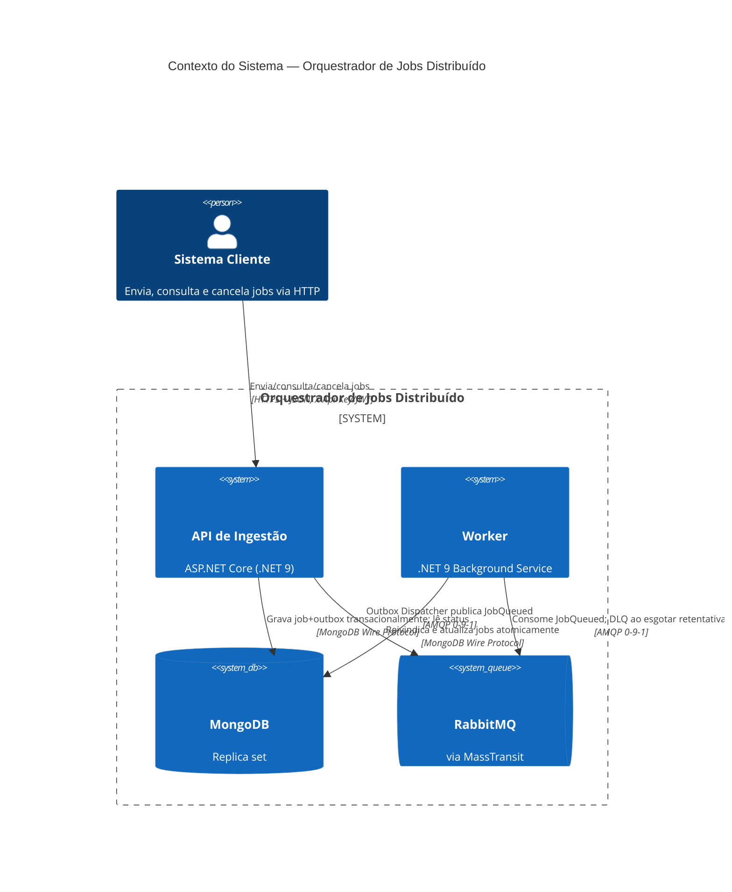
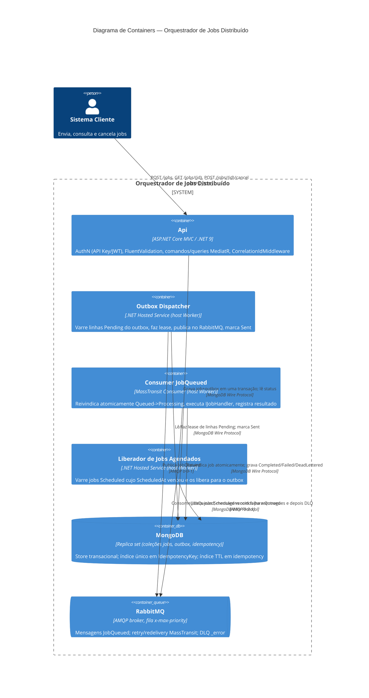

# Diagramas C4 — Orquestrador de Jobs Distribuído

> Cópia autônoma dos diagramas incorporados em [`ARCHITECTURE.md`](../../ARCHITECTURE.md) §4,
> mantida aqui para referência/linkagem fácil. Edite ambas as cópias juntas se a topologia mudar.

## Contexto do Sistema

## Diagrama de Containers

Veja [`ARCHITECTURE.md`](../../ARCHITECTURE.md) para a narrativa que estes diagramas ilustram,
incluindo o log de ADRs que explica cada escolha tecnológica.
