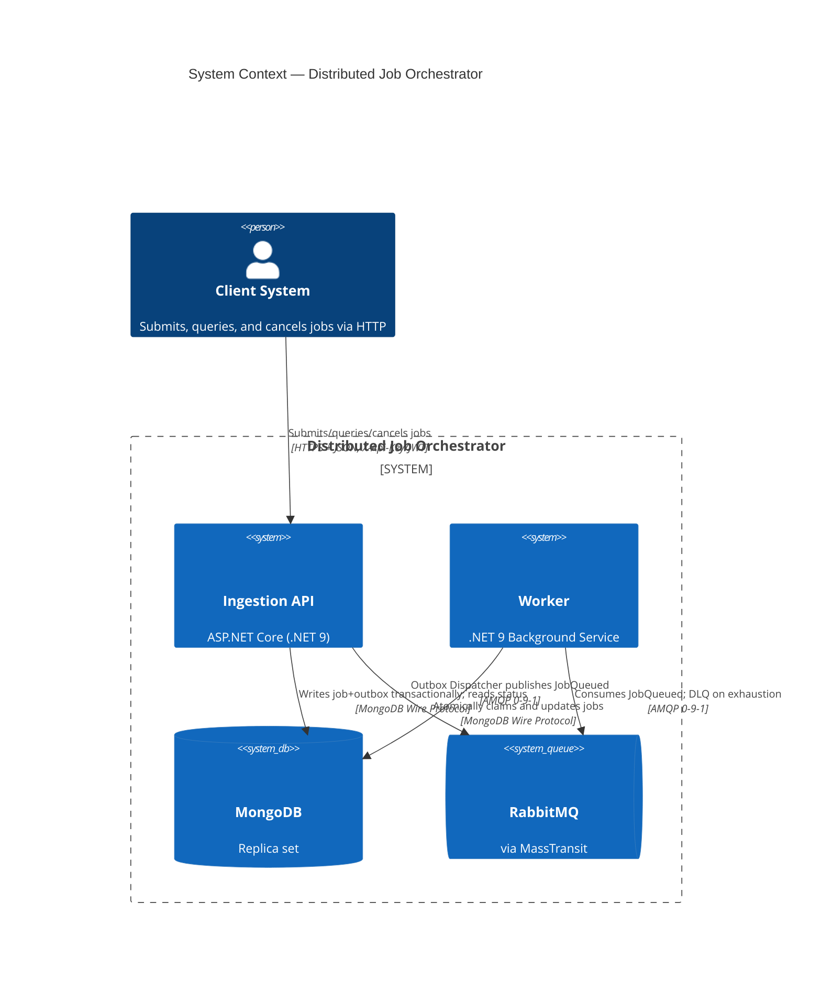
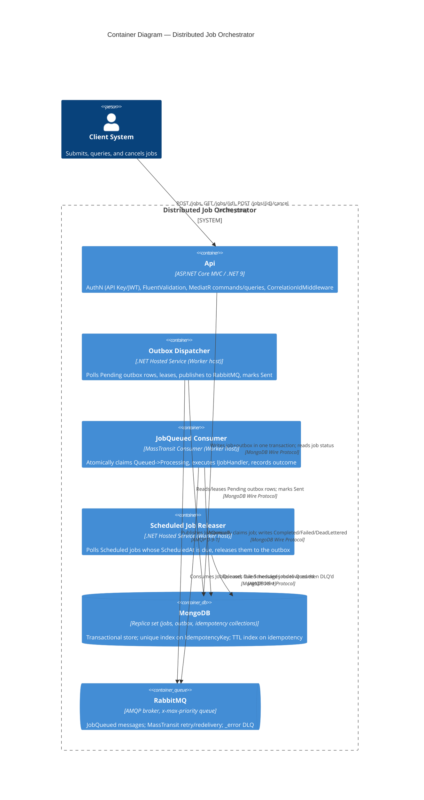

# C4 Diagrams — Distributed Job Orchestrator

> Standalone copy of the diagrams embedded in [`ARCHITECTURE.md`](../../ARCHITECTURE.md) §4, kept
> here for easy reference/linking. Edit both copies together if the topology changes.

## System Context

## Container Diagram

See [`ARCHITECTURE.md`](../../ARCHITECTURE.md) for the narrative these diagrams illustrate,
including the ADR log explaining each technology choice.
